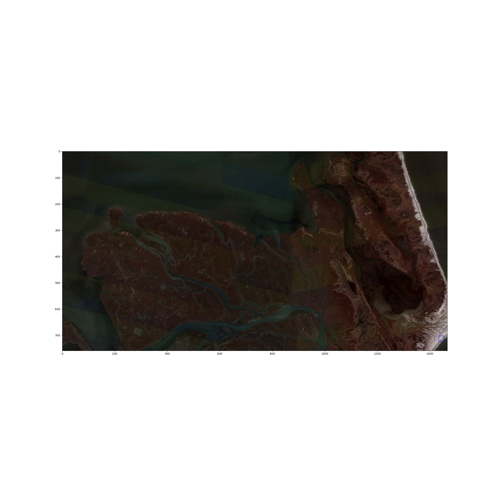
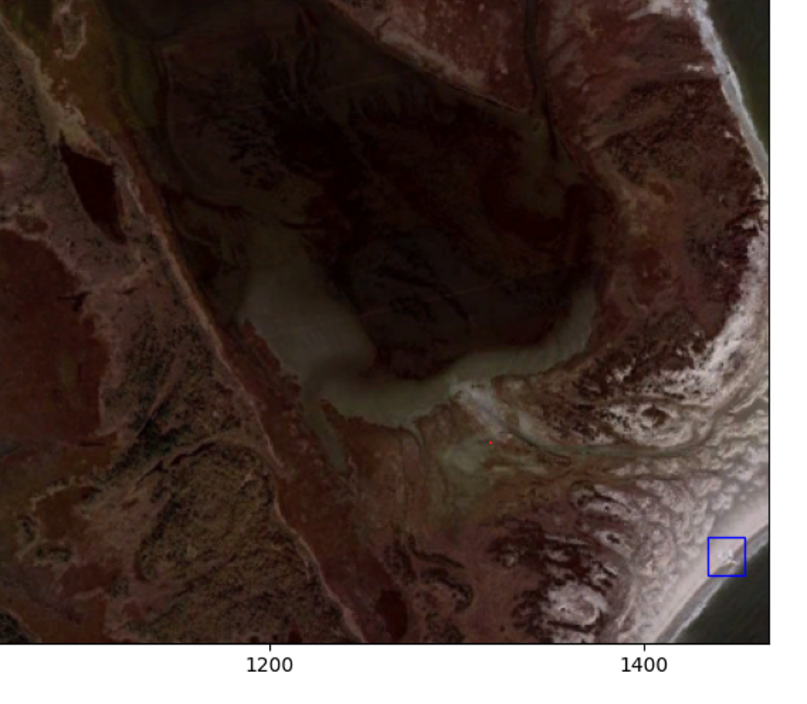

# Classification-From-Satellite-Imagery
Classifying aircraft from satellite imagery.\
Using kaggle dataset as input, identify aircraft to determine where images of the ground may be obscured by a flying aircraft

## Results

Test run on imagery that captured a lone aircraft in flight. Our CNN model captured the aircraft.

Don't see it? Let's zoom in...

<!---->

Before running in bash terminal, must run the following command to ensure relative file path compatibility:
>export PYTHONPATH=$(pwd)

To start, go to src/evaluate_model.py\
Enter the model you would like to run\
Check the results/ directory for images & plots\
There are 5 different scenes to chose for evaluation (see comments for details)\
Once you have chosen your parameters, follow instructions below

Run from terminal (bash) in directory (Classification-From-Satellite-Imagery):
>pip install -r requirements.txt\
>python3 src/evaluate_model.py

To re-train models, navigate to src/train_models.py\
Specify the model you would like to re-train\
>python3 src/train_models.py
